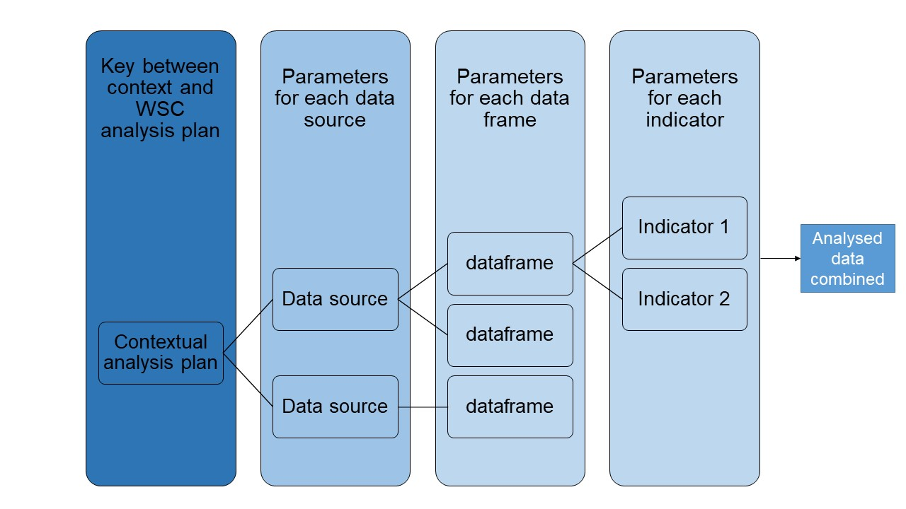

```{r setup, message=FALSE, echo=FALSE}
library(WSCprocessing)
```


[](https://github.com/WASH-Severity-Classification/WSC_processing/actions/workflows/r_cmd_check.yml)

# About this package

This packages offers functions and data pipeline useful to process data for the WASH Severity Classification (WSC). The package allows the user to implement data processing procedures layed out in the [WSC Implementation Handbook](https://docs.google.com/document/d/1ikSd_3KMOyhJ8pTr5BLXlLZ92y6h5ZpjEeyPxFilxN8/edit#bookmark=id.28of71vj4657). This includes the WASH Insecurity Score (WIS).

# Installation

You can install the latest version of WSC from [github](https://github.com/ElliottMess/WSC) with:

``` {r, eval = FALSE}
devtools::install_github("Severity-Classification/WSC_processing")
library(WSCprocessing)
```

# Setting up an analysis workflow

For more information on a step-by-step procedure on how to set up an analysis workflow, please see `vignette("setup-worklow")`

# Structure of the analysis process

The WSCprocessing package takes a russian-doll type of approach to the analysis: it works on an imbrication of a series of functions. The easiest way to look at it is to go from the contextual analysis plan (AP) and work ones way down to a single variable.

The worklfow of the analysis can then be broken down as follow:

1. **The WSC analysis plan (WSC_AP)** provides the overall framework, naming, etc. of indicators across all WSC analyses, providing global indicators to be found in all contexts, global scaling for indicators into severity phases, uniform naming of indicators, etc.
2. **data_sources** lists, describe, and categorise data sources used in the analysis. This can include narrative or tabular sources. Only tabular data are analysed with the WSCprocessing package. When data, data sources, data sets or dataframe are used in this document and in the WSCprocessing package at large, we always refer to tabular data (stored in data.frames or similar objects). 
3. **WSC contextual analysis (context_AP)** plan provides the key between the WSC_AP and the data sources that will be analysed.
4. **Data sets** are the individual data frames from data sources where the data is stored.
5. In each data sets, **variables** or indicators are analysed.



## WSC Analysis Plan

The core of the WSCprocessing is the general WSC analysis plan denoted WSC_AP in the package's functions. It consists of a spreadsheet stored on the WSC Dev Team google drive, in the [Analysis folder](https://drive.google.com/drive/folders/1lgacIV2QjzbmRxVN3vXw-hBrdzltRPk4). The WSC_AP mother sheet can be found [here](https://docs.google.com/spreadsheets/d/1TKxD_DyBTTN6onxYiooqtcI_TVSwPfeE-t7ZHK1zzMU/edit?usp=drive_web&ouid=100412281577291534733).

As a convenience, the WSC_AP is pre-loaded in WSCprocessing. It can be found in the R object WSC_AP

In the WSC_AP, each row is an indicator. All column description can be found in the description of the object that can be accessed by running:

```{r, eval = FALSE}
?WSC_AP
```

An important concept introduced in this worksheet is the globally_scaled and the affering scales columns. The goal of those column is to provide a standard way to evaluate severity for a given indicator. The content of the cell should follow a syntax using [tidy selection](https://dplyr.tidyverse.org/articles/programming.html#tidy-selection-1) to select the indicators (in the sense that you don't need to quote the indicator name) and logical operators that would be valid in a [dplyr::case_when](https://dplyr.tidyverse.org/reference/case_when.html) statement. The statements are stringed in the case_when statement from Catastrophic to None/Minimal (right to left). All percentages are treated as decimal values (90% equals 0.9).

For instance, a scale says that a Phase Catastrophic for indicator example is any value above 54% then the corresponding cell for column Catastrophic in the WSC_AP would be:
```{r, eval = FALSE}
#Catastrophic cell
example > 0.54
#Which would then be implemented as follow in the workflow:
tibble(example = runif(50, 0, 1) ) %>% 
  mutate(sev_example = case_when(eval(parse(example)) > 0.54 ~ "Catastrophic",
                                 TRUE ~ "None/Minimal")
  )
```

## data_sources

data_sources is a googlesheet that can be accessed [in English](https://docs.google.com/spreadsheets/d/1nBzXeqxVJzS5g8nbEGCIPL8fwTYyu3KYWpFgwfJQ1so/edit#gid=2068774981), [French](https://docs.google.com/spreadsheets/d/1nBzXeqxVJzS5g8nbEGCIPL8fwTYyu3KYWpFgwfJQ1so/edit#gid=890607154), and an [example](https://docs.google.com/spreadsheets/d/1nBzXeqxVJzS5g8nbEGCIPL8fwTYyu3KYWpFgwfJQ1so/edit#gid=1432680895). It is heavily linked to the context_AP and data_sources should be filled in before moving on to context_AP.
The column definition is as follow:

```{r, message=F, echo=F}
data_sources <- read_sheet("https://docs.google.com/spreadsheets/d/1nBzXeqxVJzS5g8nbEGCIPL8fwTYyu3KYWpFgwfJQ1so/edit?usp=sharing", sheet = "README", range = "A13:B24")
knitr::kable(data_sources)
```

## context_AP

To provide a link between the WSC_AP and the context in which the analysis is conducted, it is necessary to set up a context_AP that provides the link between the WSC_AP and the different data sources.

This is done through a googlesheet that can be accessed in [English](https://docs.google.com/spreadsheets/d/1nBzXeqxVJzS5g8nbEGCIPL8fwTYyu3KYWpFgwfJQ1so/edit#gid=324383366), [French](https://docs.google.com/spreadsheets/d/1nBzXeqxVJzS5g8nbEGCIPL8fwTYyu3KYWpFgwfJQ1so/edit#gid=0), and an [example](https://docs.google.com/spreadsheets/d/1nBzXeqxVJzS5g8nbEGCIPL8fwTYyu3KYWpFgwfJQ1so/edit#gid=1704438982).

In this googlesheet, each row is an indicator_code from the WSC_AP. Columns should be filled in as follow:
```{r, message=F, echo=F}
data_sources <- read_sheet("https://docs.google.com/spreadsheets/d/1nBzXeqxVJzS5g8nbEGCIPL8fwTYyu3KYWpFgwfJQ1so/edit?usp=sharing", sheet = "README", range = "A28:B49")
knitr::kable(data_sources)
```

Some information will seem duplicated from one `data_source` to the other, but this is to make sure that the package is looking at the right place for the information. Indeed, it can sometime be quite difficult to organise the data in a way that is always consistent. The approach is then to make sure that we are systematically looking in the right place for the data.

The `data_source` "SMART-2019" in the [example context_AP](https://docs.google.com/spreadsheets/d/1nBzXeqxVJzS5g8nbEGCIPL8fwTYyu3KYWpFgwfJQ1so/edit#gid=1704438982) is a good example of this difficult. Indeed, the same datasource provides information on multiple administrative unit. It is then necessary to split the data into two sheets (admin1 and admin2) so that the package can look in the right place and process the data in a consistent way.

See the `vignette("setup-workflow")` for more details.

# Main functions

The package is organised around a series of function that take the different steps of the analysis process and structure them to have consistent processes.

There are 5 families of functions in the package:

* Clean: clean the datasets
* Recode: recode datasets between 
* Aggregation: aggregate results at a given administrative unit
* Score: score datasets according to the WSC_AP and the twenty percent rule
* Analyse: Analyse data to fit into the final outputs

## Clean
Three functions available:

* `clean_dataset()` and `rec_missing` replace common NA values ('N/A','n/a',' ','(vide)','(empty)','d/m','','NA','na') by a R NA, respectively on a whole dataset or a vector
* `normalise_string` removes special characters, spaces, etc. to have a normalised string.

## Recode

*`recode_variable` and `recode_source` take values from the context_AP and rename columns and values to match it, respectivelly for one indicator/variable or for a whole data_source
*`rename_vec` rename a vector from a list ot another. It is the backbone of the two other functions in the family.

## Aggregation

* `aggregate_admin` Aggregate variables at the specified administrative unit
* `agg_score` a specialised version of aggregate_admin for the WIS
* `assign_result_high2low` and `assign_result_low2high` assign results from different level of analysis to the level that we are interested in. For instance, if our level of analysis is admin2 and data is available only at admin1, we assign the data from the admin1 to all the admin2s.

```{r}
normalise_string("àaF   kgfk")
```

## Analyse

This is where the russian-dolls concept is the most pertinent as those functions are wrappers around each others.

* `analyse_country` analyse the data for a specified country, breaking ties between data sources for a specified indicator.
* `analyse_DAP` analyse a DAP, without breaking ties between data sources
* `analyse_source_all_sheets` analyse all data in a data source
* `analyse_data` analyse a data set
* `analyse_var` analyse a variable

# Datasets available in the package

Multiple datasets are available in the package to provide real-life examples of how the data can be processed:

* `bfa_msna_2020` : 2020 Burkina Faso MSNA
* `bfa_smart_2019_admin1` : SMART survey data for 2019 in Burkina Faso.
* `context_AP` : example of context_AP object.

For convenience, those datasets are also loaded:

* `WSC_AP`
* `WIS_water`
* `WIS_sanitation`
* `WIS_final`

# About the WSC
The WASH Severity Classification (WSC) is a new interagency global initiative led by the [Global WASH Cluster](http://washcluster.net/), [UNICEF](https://www.unicef.org/), and [IMPACT Initiatives](impact-initiatives.org/).
Developed at the global level through a participatory process, the WSC project aims to develop a standardized approach to classifying the severity of WASH needs and vulnerabilities across contexts.
For more information, contact wsc@reach-initiative.org.
