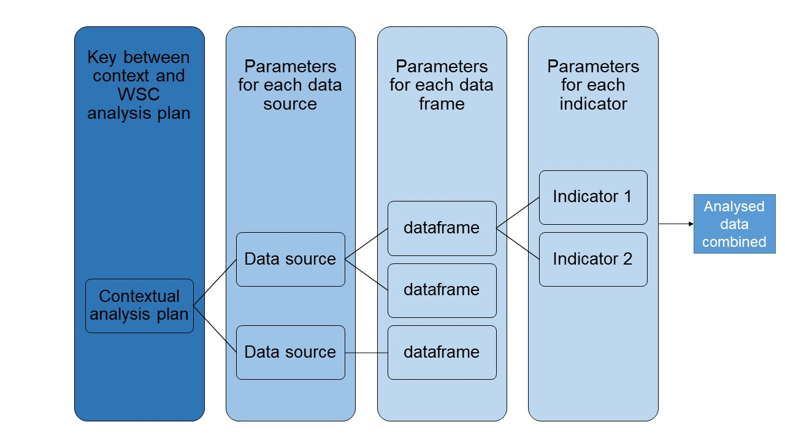

# WASH severity classification (WSC) processing 

[](https://github.com/WASH-Severity-Classification/WSC_processing/actions/workflows/r_cmd_check.yml)

## About this package

This packages offers functions and data pipeline useful to process data
for the WASH Severity Classification (WSC). The package allows the user
to implement data processing procedures layed out in the [WSC
Implementation
Handbook](https://docs.google.com/document/d/1ikSd_3KMOyhJ8pTr5BLXlLZ92y6h5ZpjEeyPxFilxN8/edit#bookmark=id.28of71vj4657).
This includes the WASH Insecurity Score (WIS).

## Installation

You can install the latest version of WSC from
[github](https://github.com/ElliottMess/WSC) with:

``` r
devtools::install_github("Severity-Classification/WSC_processing")
library(WSCprocessing)
```

## Setting up an analysis workflow

For more information on a step-by-step procedure on how to set up an
analysis workflow, please see `vignette("setup-worklow")`

## Structure of the analysis process

The WSCprocessing package takes a russian-doll type of approach to the
analysis: it works on an imbrication of a series of functions. The
easiest way to look at it is to go from the contextual analysis plan
(AP) and work ones way down to a single variable.

The worklfow of the analysis can then be broken down as follow:

1.  **The WSC analysis plan (WSC\_AP)** provides the overall framework,
    naming, etc. of indicators across all WSC analyses, providing global
    indicators to be found in all contexts, global scaling for
    indicators into severity phases, uniform naming of indicators, etc.
2.  **data\_sources** lists, describe, and categorise data sources used
    in the analysis. This can include narrative or tabular sources. Only
    tabular data are analysed with the WSCprocessing package. When data,
    data sources, data sets or dataframe are used in this document and
    in the WSCprocessing package at large, we always refer to tabular
    data (stored in data.frames or similar objects).
3.  **WSC contextual analysis (context\_AP)** plan provides the key
    between the WSC\_AP and the data sources that will be analysed.
4.  **Data sets** are the individual data frames from data sources where
    the data is stored.
5.  In each data sets, **variables** or indicators are analysed.



### WSC Analysis Plan

The core of the WSCprocessing is the general WSC analysis plan denoted
WSC\_AP in the package’s functions. It consists of a spreadsheet stored
on the WSC Dev Team google drive, in the [Analysis
folder](https://drive.google.com/drive/folders/1lgacIV2QjzbmRxVN3vXw-hBrdzltRPk4).
The WSC\_AP mother sheet can be found
[here](https://docs.google.com/spreadsheets/d/1TKxD_DyBTTN6onxYiooqtcI_TVSwPfeE-t7ZHK1zzMU/edit?usp=drive_web&ouid=100412281577291534733).

As a convenience, the WSC\_AP is pre-loaded in WSCprocessing. It can be
found in the R object WSC\_AP

In the WSC\_AP, each row is an indicator. All column description can be
found in the description of the object that can be accessed by running:

``` r
?WSC_AP
```

An important concept introduced in this worksheet is the
globally\_scaled and the affering scales columns. The goal of those
column is to provide a standard way to evaluate severity for a given
indicator. The content of the cell should follow a syntax using [tidy
selection](https://dplyr.tidyverse.org/articles/programming.html#tidy-selection-1)
to select the indicators (in the sense that you don’t need to quote the
indicator name) and logical operators that would be valid in a
[dplyr::case\_when](https://dplyr.tidyverse.org/reference/case_when.html)
statement. The statements are stringed in the case\_when statement from
Catastrophic to None/Minimal (right to left). All percentages are
treated as decimal values (90% equals 0.9).

For instance, a scale says that a Phase Catastrophic for indicator
example is any value above 54% then the corresponding cell for column
Catastrophic in the WSC\_AP would be:

``` r
#Catastrophic cell
example > 0.54
#Which would then be implemented as follow in the workflow:
tibble(example = runif(50, 0, 1) ) %>% 
  mutate(sev_example = case_when(eval(parse(example)) > 0.54 ~ "Catastrophic",
                                 TRUE ~ "None/Minimal")
  )
```

### data\_sources

data\_sources is a googlesheet that can be accessed [in
English](https://docs.google.com/spreadsheets/d/1nBzXeqxVJzS5g8nbEGCIPL8fwTYyu3KYWpFgwfJQ1so/edit#gid=2068774981),
[French](https://docs.google.com/spreadsheets/d/1nBzXeqxVJzS5g8nbEGCIPL8fwTYyu3KYWpFgwfJQ1so/edit#gid=890607154),
and an
[example](https://docs.google.com/spreadsheets/d/1nBzXeqxVJzS5g8nbEGCIPL8fwTYyu3KYWpFgwfJQ1so/edit#gid=1432680895).
It is heavily linked to the context\_AP and data\_sources should be
filled in before moving on to context\_AP. The column definition is as
follow:

| Column                                                       | Description                                                                                                                                                                                           |
| :----------------------------------------------------------- | :---------------------------------------------------------------------------------------------------------------------------------------------------------------------------------------------------- |
| Organisation/Organisation                                    | character Name of the organisation published the data source                                                                                                                                          |
| Source name/Nom de la source                                 | character Name of the data source. Should be explicit and short.                                                                                                                                      |
| Description/Description                                      | character Description of the content of the data sources. For surveys, it should include short methodology note with number of interviews, representativeness of the sample,and when it was conducted |
| Year/Année                                                   | number Year of publication                                                                                                                                                                            |
| Limits of the source/Limites de la source                    | character Limits of the data source: what should analyst know about the limitations of the data source                                                                                                |
| Dataset code/Code source                                     | character String creating a unique identifier for the data source. Avoid spaces and special characters (accents, ponctuations, etc.)                                                                  |
| Administrative units covered/Unités administrative couvertes | character Drop-down menu with the different administrative unit level possible in a country.                                                                                                          |
| Data level/Niveau de donnée                                  | character Drop-down menu with the different type of data analysed: household-level or area-level.                                                                                                     |
| Time relevance (T)/Pertinance temporelle (T)                 | character Drop-down menu to evaluate time relevance of the data source. For further definition see Implementation Handbook section “Protocol 2.4: Assess evidence reliability”                        |
| Soundness of method (M)/Solidité de la méthode (M)           | character Drop-down menu to evaluate soundress of method of the data source. For further definition see Implementation Handbook section “Protocol 2.4: Assess evidence reliability”                   |
| Overall reliability/Fiabilité globale                        | character Formula, DO NOT modify. Implements the reliability scoring outlined in the Implementation Handbook                                                                                          |

### context\_AP

To provide a link between the WSC\_AP and the context in which the
analysis is conducted, it is necessary to set up a context\_AP that
provides the link between the WSC\_AP and the different data sources.

This is done through a googlesheet that can be accessed in
[English](https://docs.google.com/spreadsheets/d/1nBzXeqxVJzS5g8nbEGCIPL8fwTYyu3KYWpFgwfJQ1so/edit#gid=324383366),
[French](https://docs.google.com/spreadsheets/d/1nBzXeqxVJzS5g8nbEGCIPL8fwTYyu3KYWpFgwfJQ1so/edit#gid=0),
and an
[example](https://docs.google.com/spreadsheets/d/1nBzXeqxVJzS5g8nbEGCIPL8fwTYyu3KYWpFgwfJQ1so/edit#gid=1704438982).

In this googlesheet, each row is an indicator\_code from the WSC\_AP.
Columns should be filled in as follow:

| Column                          | Description                                                                                                                                                                                                                                                        |
| :------------------------------ | :----------------------------------------------------------------------------------------------------------------------------------------------------------------------------------------------------------------------------------------------------------------- |
| Niveau du cadre analytique      | character Niveau/Dimension du cadre analytique comme vu dans le cadre analytique CSW.                                                                                                                                                                              |
| Analytical framework level      | character Analytical framework level/dimension as in the WSC analytical framework                                                                                                                                                                                  |
| Sous-niveau du cadre analytique | character Sous-niveau/sous-dimension du cadre analytique comme vu dans le cadre analytique CSW                                                                                                                                                                     |
| Analytical framework sub-level  | character Analytical framework sub-level/sub-dimension as in the WSC analytical framework                                                                                                                                                                          |
| Indicator                       | character Complete description of the indicator.                                                                                                                                                                                                                   |
| Indicateur                      | character Description complète de l’indicateur.                                                                                                                                                                                                                    |
| indicator\_code                 | character Indicator code, as in the WSC analysis plan                                                                                                                                                                                                              |
| context                         | character Context to which the specific indicator applies. This is to be used if multiple context (geographical or temporal) are being analysed. For instance, if data is used for Burkina Faso in 2020 and 2019, this column can help distinguish the indicators. |
| data\_source\_name              | character Name of the data source. There a data validation drop-down from the data sources sheets to avoid mistakes.                                                                                                                                               |
| data\_worksheet\_url            | character (URL) URL (link) to where the indicator data source is stored and accessible as a worksheet                                                                                                                                                              |
| data\_sheet\_name               | character sheet name where the indicator data source is stored and accessible                                                                                                                                                                                      |
| indicator\_code\_source         | Indicator code as in the analysed dataset (e.g. the column name)                                                                                                                                                                                                   |
| admin\_level                    | Most granular level at which the data is available                                                                                                                                                                                                                 |
| data\_type                      | Type of data: either household (coded hh) or area (coded area).                                                                                                                                                                                                    |
| question\_type                  | Type of questions with choice list linked to it. It should follow the same structure (select\_one, select\_multiple, integer) as in XLSForm                                                                                                                        |
| question\_label                 | Label of question as in the form                                                                                                                                                                                                                                   |
| choices\_list                   | Name of choices list, if relevant. This is particularly helpful to link the indicator to an ODK/kobo form with XLSForm. See here for more details on XLSforms.                                                                                                     |
| choices\_name                   | Code for the choice that will be used to classify/score the question                                                                                                                                                                                               |
| choices\_label                  | Name for the choice that will be used to classify/score the question                                                                                                                                                                                               |
| score\_recoding                 | Score/new value to attributed to the choice for the indicator                                                                                                                                                                                                      |
| reliability\_score              | Reliability score of the data source. From data\_source\_sheet                                                                                                                                                                                                     |

Some information will seem duplicated from one `data_source` to the
other, but this is to make sure that the package is looking at the right
place for the information. Indeed, it can sometime be quite difficult to
organise the data in a way that is always consistent. The approach is
then to make sure that we are systematically looking in the right place
for the data.

The `data_source` “SMART-2019” in the [example
context\_AP](https://docs.google.com/spreadsheets/d/1nBzXeqxVJzS5g8nbEGCIPL8fwTYyu3KYWpFgwfJQ1so/edit#gid=1704438982)
is a good example of this difficult. Indeed, the same datasource
provides information on multiple administrative unit. It is then
necessary to split the data into two sheets (admin1 and admin2) so that
the package can look in the right place and process the data in a
consistent way.

See the `vignette("setup-workflow")` for more details.

## Main functions

The package is organised around a series of function that take the
different steps of the analysis process and structure them to have
consistent processes.

There are 5 families of functions in the package:

  - Clean: clean the datasets
  - Recode: recode datasets between
  - Aggregation: aggregate results at a given administrative unit
  - Score: score datasets according to the WSC\_AP and the twenty
    percent rule
  - Analyse: Analyse data to fit into the final outputs

### Clean

Three functions available:

  - `clean_dataset()` and `rec_missing` replace common NA values
    (‘N/A’,‘n/a’,’ ‘,’(vide)‘,’(empty)‘,’d/m’,’‘,’NA’,‘na’) by a R
    NA, respectively on a whole dataset or a vector
  - `normalise_string` removes special characters, spaces, etc. to have
    a normalised string.

### Recode

*`recode_variable` and `recode_source` take values from the context\_AP
and rename columns and values to match it, respectivelly for one
indicator/variable or for a whole data\_source *`rename_vec` rename a
vector from a list ot another. It is the backbone of the two other
functions in the family.

### Aggregation

  - `aggregate_admin` Aggregate variables at the specified
    administrative unit
  - `agg_score` a specialised version of aggregate\_admin for the WIS
  - `assign_result_high2low` and `assign_result_low2high` assign results
    from different level of analysis to the level that we are interested
    in. For instance, if our level of analysis is admin2 and data is
    available only at admin1, we assign the data from the admin1 to all
    the admin2s.

<!-- end list -->

``` r
normalise_string("àaF   kgfk")
```

    ## [1] "aaf_kgfk"

### Analyse

This is where the russian-dolls concept is the most pertinent as those
functions are wrappers around each others.

  - `analyse_country` analyse the data for a specified country, breaking
    ties between data sources for a specified indicator.
  - `analyse_DAP` analyse a DAP, without breaking ties between data
    sources
  - `analyse_source_all_sheets` analyse all data in a data source
  - `analyse_data` analyse a data set
  - `analyse_var` analyse a variable

## Datasets available in the package

Multiple datasets are available in the package to provide real-life
examples of how the data can be processed:

  - `bfa_msna_2020` : 2020 Burkina Faso MSNA
  - `bfa_smart_2019_admin1` : SMART survey data for 2019 in Burkina
    Faso.
  - `context_AP` : example of context\_AP object.

For convenience, those datasets are also loaded:

  - `WSC_AP`
  - `WIS_water`
  - `WIS_sanitation`
  - `WIS_final`

## About the WSC

The WASH Severity Classification (WSC) is a new interagency global
initiative led by the [Global WASH Cluster](http://washcluster.net/),
[UNICEF](https://www.unicef.org/), and [IMPACT
Initiatives](impact-initiatives.org/). Developed at the global level
through a participatory process, the WSC project aims to develop a
standardized approach to classifying the severity of WASH needs and
vulnerabilities across contexts. For more information, contact
<wsc@reach-initiative.org>.
